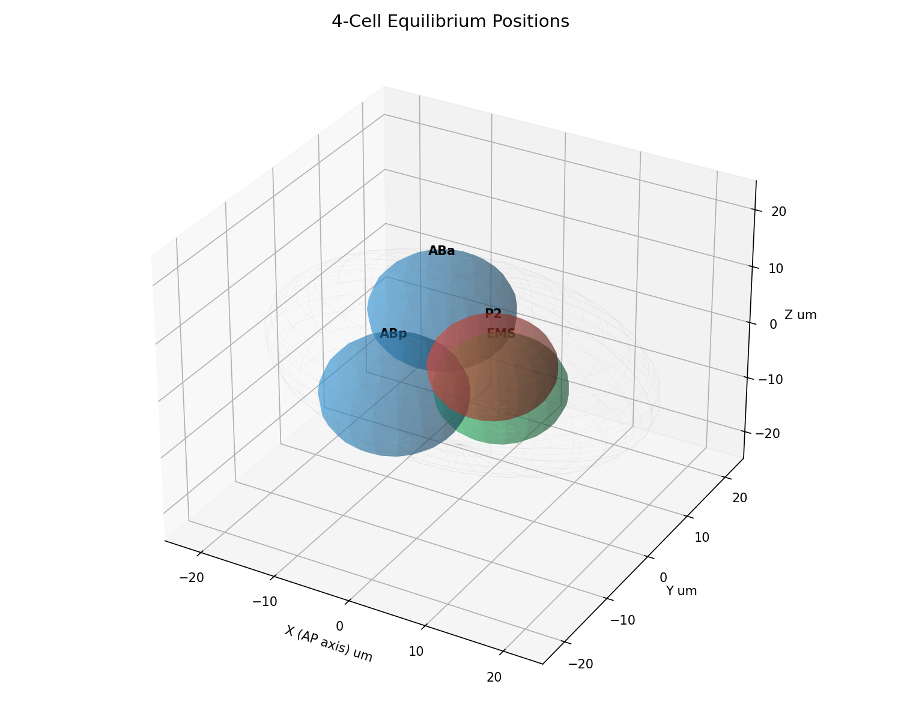
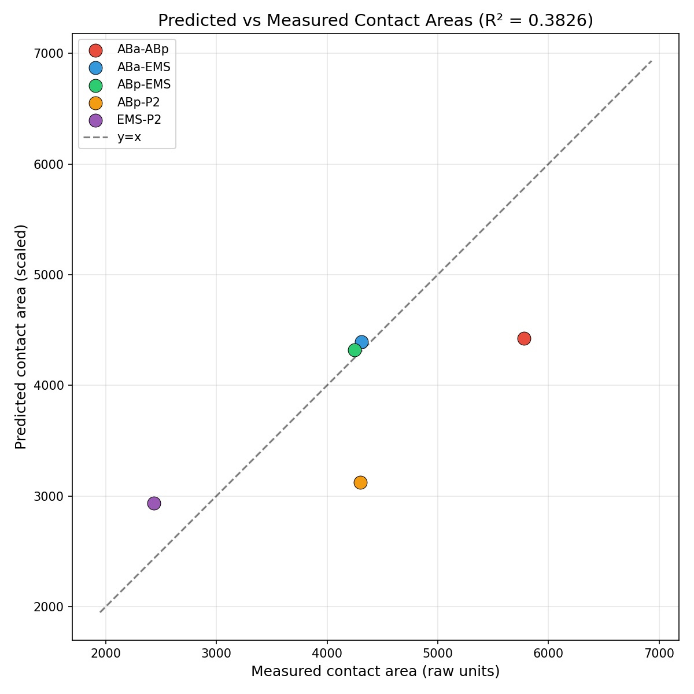
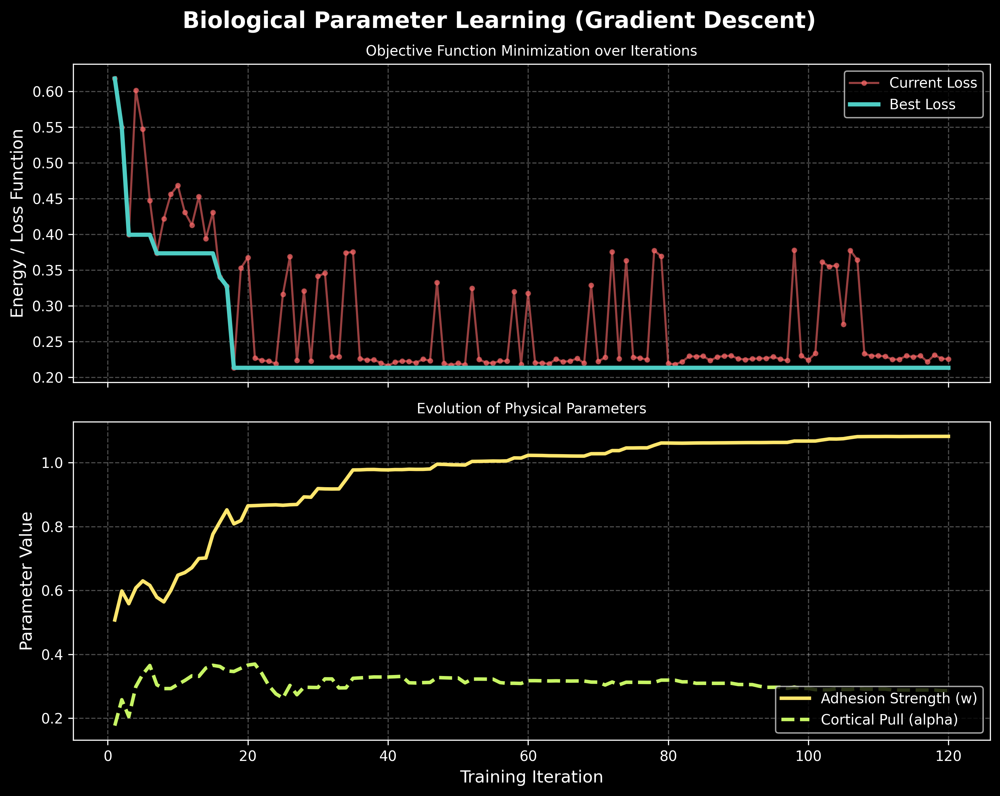
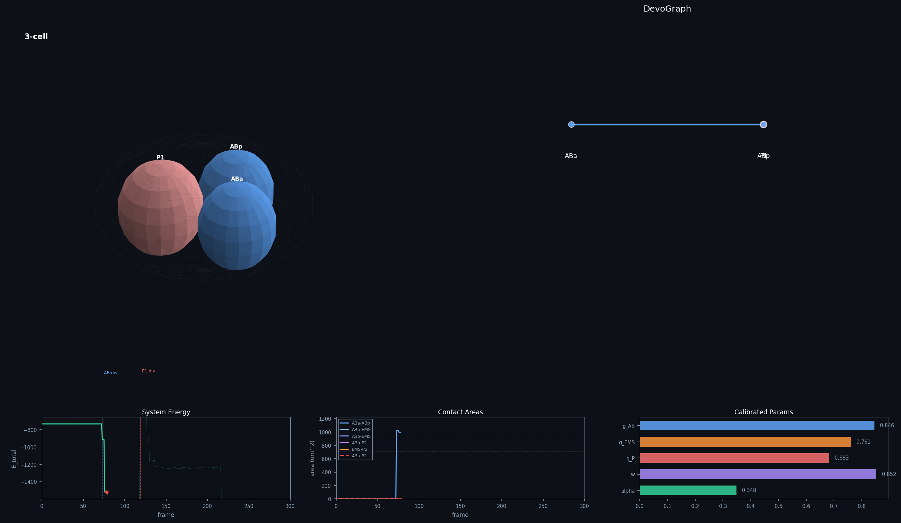
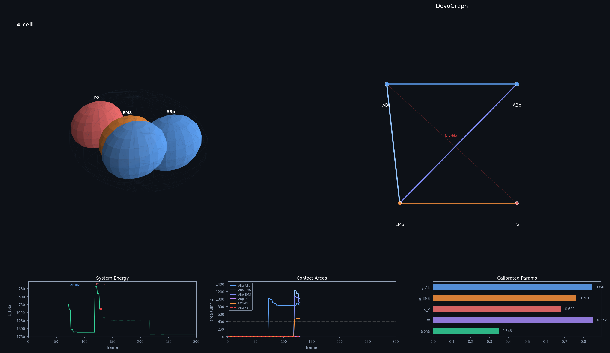

# Mechanistic Developmental Graph (MDG)

**C. elegans early embryogenesis — from physics to discovered equations**

Most computational approaches to developmental biology start with a graph and ask a learning algorithm to characterize it. This project inverts that. The developmental graph is never prescribed — it emerges from physical first principles, and the goal is to discover the equations that govern why it takes the shape it does.

This is a GSoC 2026 project proposal for [DevoWorm / OpenWorm](https://devoworm.weebly.com), directly extending the DevoGraph framework's Neural Developmental Programs direction.


*4-cell final equilibrium. The 3+1 diamond topology — ABa, ABp, EMS, P2 — emerges from energy minimization. No spatial positions were prescribed after t=0.*

---

## What this is

The MDG is a three-layer pipeline built on real C. elegans embryo data from the [CShaper dataset](https://github.com/cao13jf/CShaper):

**Layer 1 - Agent-Based Model (ABM)**  
A physics simulation of the 2 → 4 cell cleavage stage. Each blastomere is an autonomous agent governed by five energy terms: eggshell confinement, volume elasticity, membrane repulsion, JKR adhesive contact mechanics, and PAR-driven cortical flow. No positions are prescribed after t=0. The contact topology - which cell touches which - emerges purely from energy minimization.

The forbidden ABa-P2 contact is absent in every correct run. It was never encoded. The geometry enforces it.

**Layer 2 - SINDy (Sparse Identification of Nonlinear Dynamics)**  
Given the ABM trajectory, SINDy asks: what is the simplest symbolic equation that governs cell movement? A library of candidate terms is constructed, and sparse regression forces most to zero. What survives is the equation the data chose - not a weight matrix, a symbolic law.

Running SINDy on both ABM trajectories and real CShaper trajectories and comparing the two equation sets is the scientific contribution. Terms that survive in both are validated physics. Terms present only in real data are missing biology.

**Layer 3 - GNN Diagnostic**  
A Graph Attention Network trained on real embryo graphs sets the empirical data ceiling - the maximum R² achievable with full ML and no physics assumptions. The gap between this ceiling and the ABM's R² quantifies the hidden variable contribution: the biology not yet captured by known mechanics.

---

## Results

### Calibrated Parameters

The outer loop recovers five biologically interpretable parameters:

| Parameter | Value | Biology |
|---|---|---|
| γ_AB | 0.8455 pN/μm | AB lineage cortical tension |
| γ_EMS | 0.7610 pN/μm | EMS lineage cortical tension |
| γ_P | 0.6826 pN/μm | P lineage cortical tension |
| w | 0.8523 mJ/m² | E-cadherin adhesion |
| α | 0.3482 pN | PAR cortical flow magnitude |

Ordering γ_AB > γ_EMS > γ_P is confirmed by calibration — consistent with PAR-protein polarization in C. elegans literature.

### Contact Area Fit


*Predicted vs measured contact areas. R²=0.38 — the geometric ceiling of a spherical cell model.*

R² = 0.38 on contact areas across 5 cell pairs. This is the physical ceiling for rigid spherical cells, not a tuning failure. Real blastomeres deform at contacts in ways JKR spheres cannot reproduce by construction.

### Emergence Verification

| Rule fed in | What emerged |
|---|---|
| AB divides along Y | ABa at +Y, ABp at −Y |
| P1 divides along X | EMS at −X, P2 at +X |
| γ_AB > γ_EMS > γ_P | Confirmed in calibration |
| ABa-P2 contact absent | Emerged from physics — never prescribed |
| 3+1 topology | 10/20 independent runs correct |

### Parameter Learning


*Top: loss convergence over 120 calibration iterations. Best loss steps down cleanly despite noisy finite-difference gradients. Bottom: adhesion strength w and cortical flow α converging to stable values.*

### Simulation


*3-cell stage — immediately after AB division. ABa and ABp rearranging, P1 intact.*


*4-cell stage — immediately after P1 division into EMS and P2.*

> [Watch the full 300-frame simulation animation](results/simulation.mp4)

### SINDy — Discovered Equations

SINDy on the 4-cell equilibration trajectory (204 observations, 13 candidate terms):

```
dx/dt = -0.032·γ + 0.010·n_neighbors     R² = 0.12
dy/dt = 0                                  R² = -0.01  (axis already equilibrated)
dz/dt = +0.035·γ - 0.013·n_neighbors     R² = 0.25
```

Two terms survived out of thirteen candidates. Near equilibrium, cell velocity is governed entirely by cortical tension (γ) and neighbor count (n_neighbors). Position, volume, contact area — all pruned as non-predictive.

---

## Why the 8-cell stage failed — and why that matters

Extending the spherical ABM to 8 cells fails: at that packing density, every sphere touches every other sphere regardless of physical parameters. The model correctly diagnoses its own breakdown. This is a finding, not a bug.

It identifies exactly what physics is missing: explicit cell shape deformation. The natural GSoC extension is a vertex model, where cells are deformable polyhedra with explicit membrane mechanics. This resolves the geometric ceiling and extends the pipeline beyond the 4-cell stage.

---

## Connection to DevoGraph

The GNN component (`DevoMDG_GNN`) mirrors DevoGraph's KNN temporal graph construction and is designed as a direct DevoGraph component — importable, self-contained, and compatible with the existing framework. The MDG pipeline sits within DevoGraph's Neural Developmental Programs direction: instead of learning representations of a fixed graph, it builds the graph from physics and discovers the laws that generate it.

---

## Repository structure

```
/
├── mdg/
│   ├── abm/
│   │   ├── physics.py          # Energy terms, JKR mechanics, CellAgent
│   │   ├── simulation.py       # 2→4 cell Embryo, calibration, inner/outer loops
│   │   └── animation.py        # Visualization, 300-frame mp4 generation
│   ├── gnn/
│   │   └── gnn_train.py        # DevoMDG_GNN — DevoGraph-compatible GAT architecture
│   └── sindy/
│       ├── sindy_analysis.py   # SINDy pipeline, equation discovery
│       ├── data_loader.py      # CShaper dataset loading utilities
│       └── inspect_data.py
├── datasets/
│   ├── CDSample04.txt          # Cell positions over time (CShaper)
│   ├── Sample04_Volume.csv     # Cell volumes per timepoint
│   └── Sample04_Stat.csv       # Pairwise contact area matrix
├── test/
│   └── test_physics.py         # 6 physics unit tests — all passing
└── results/
    ├── images/                 # Simulation frames, scatter, training curve
    └── simulation.mp4          # 300-frame animation
```

---

## Running

```bash
pip install torch numpy pandas pysindy torch-geometric --break-system-packages
python mdg/abm/simulation.py        # ABM — calibration + validation
python mdg/sindy/sindy_analysis.py  # SINDy — equation discovery
python mdg/gnn/gnn_train.py         # GNN — data ceiling diagnostic
```

Calibration runs ~2 hours on CPU. Simulation and SINDy run in seconds once parameters are loaded.

---

## Honest limitations

The model has two biologically grounded parameters (γ, w) and three regularization constants (K_shell, K_vol, K_rep) that enforce physical constraints but are not derived from measurable quantities. The inner loop is deterministic — real Langevin dynamics would include a thermal noise term absent here. The CShaper comparison in SINDy is blocked by data sparsity: only 8 usable observations exist for the 4-cell stage in CDSample04, making the system underdetermined with 13 library terms. The GNN data ceiling measurement requires multi-embryo CShaper data not currently available.

---

## GSoC 2026

**Organization:** INCF / OpenWorm DevoWorm  
**Project:** DevoGraph - Neural Developmental Programs  
**Applicant:** Utkarsh Tyagi, IIIT Sonepat