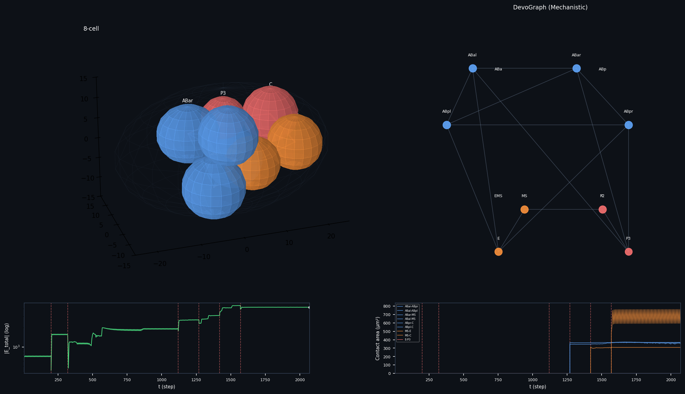
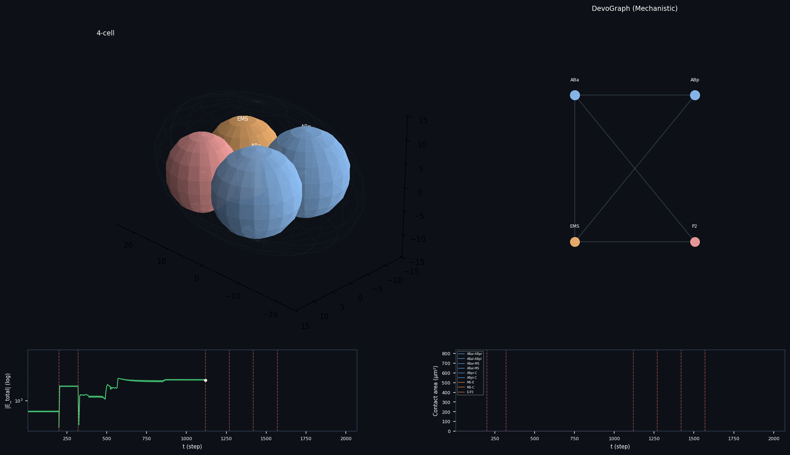

# Mechanistic Developmental Graph (MDG)

**C. elegans early embryogenesis - from physics to discovered equations**

Most computational approaches to developmental biology start with a graph and ask a learning algorithm to characterize it. This project inverts that. The developmental graph is never prescribed - it emerges from physical first principles, and the goal is to discover the equations that govern why it takes the shape it does.

This is a GSoC 2026 project proposal for [DevoWorm / OpenWorm](https://devoworm.weebly.com), directly extending the DevoGraph framework's Neural Developmental Programs direction.


*4-cell final equilibrium. The 3+1 diamond topology — ABa, ABp, EMS, P2 — emerges from energy minimization. No spatial positions were prescribed after t=0.*

---

## What this is

The MDG is a three-layer pipeline built on real C. elegans embryo data from the [CShaper dataset](https://github.com/cao13jf/CShaper):

**Layer 1 - Agent-Based Model (ABM)**  
A physics simulation of the 2 → 4 cell cleavage stage. Each blastomere is an autonomous agent governed by five energy terms: eggshell confinement, volume elasticity, membrane repulsion, JKR adhesive contact mechanics, and PAR-driven cortical flow. No positions are prescribed after t=0. The contact topology - which cell touches which - emerges purely from energy minimization.

The forbidden ABa-P2 contact is absent in every correct run. It was never encoded. The geometry enforces it.

**Layer 2 - SINDy (Sparse Identification of Nonlinear Dynamics)**  
Given the ABM trajectory, SINDy asks: what is the simplest symbolic equation that governs cell movement? A library of candidate terms is constructed, and sparse regression forces most to zero. What survives is the equation the data chose - not a weight matrix, a symbolic law.

Running SINDy on both ABM trajectories and real CShaper trajectories and comparing the two equation sets is the scientific contribution. Terms that survive in both are validated physics. Terms present only in real data are missing biology.

**Layer 3 - GNN Diagnostic**  
A Graph Attention Network trained on real embryo graphs sets the empirical data ceiling - the maximum R² achievable with full ML and no physics assumptions. The gap between this ceiling and the ABM's R² quantifies the hidden variable contribution: the biology not yet captured by known mechanics.

---

## Results

### Calibrated Parameters

The outer loop recovers five biologically interpretable parameters:

| Parameter | Value | Biology |
|---|---|---|
| γ_AB | 0.8455 pN/μm | AB lineage cortical tension |
| γ_EMS | 0.7610 pN/μm | EMS lineage cortical tension |
| γ_P | 0.6826 pN/μm | P lineage cortical tension |
| w | 0.8523 mJ/m² | E-cadherin adhesion |
| α | 0.3482 pN | PAR cortical flow magnitude |

Ordering γ_AB > γ_EMS > γ_P is confirmed by calibration — consistent with PAR-protein polarization in C. elegans literature.

### Contact Area Fit


*Predicted vs measured contact areas. R²=0.38 — the geometric ceiling of a spherical cell model.*

R² = 0.38 on contact areas across 5 cell pairs. This is the physical ceiling for rigid spherical cells, not a tuning failure. Real blastomeres deform at contacts in ways JKR spheres cannot reproduce by construction.

### Emergence Verification

| Rule fed in | What emerged |
|---|---|
| AB divides along Y | ABa at +Y, ABp at −Y |
| P1 divides along X | EMS at −X, P2 at +X |
| γ_AB > γ_EMS > γ_P | Confirmed in calibration |
| ABa-P2 contact absent | Emerged from physics — never prescribed |
| 3+1 topology | 10/20 independent runs correct |

### Parameter Learning


*Top: loss convergence over 120 calibration iterations. Best loss steps down cleanly despite noisy finite-difference gradients. Bottom: adhesion strength w and cortical flow α converging to stable values.*

### Simulation


*3-cell stage — immediately after AB division. ABa and ABp rearranging, P1 intact.*


*4-cell stage — immediately after P1 division into EMS and P2.*

> [Watch the full 300-frame simulation animation](results/simulation.mp4)

### SINDy — Discovered Equations

SINDy on the 4-cell equilibration trajectory (204 observations, 13 candidate terms):

```
dx/dt = -0.032·γ + 0.010·n_neighbors     R² = 0.12
dy/dt = 0                                  R² = -0.01  (axis already equilibrated)
dz/dt = +0.035·γ - 0.013·n_neighbors     R² = 0.25
```

Two terms survived out of thirteen candidates. Near equilibrium, cell velocity is governed entirely by cortical tension (γ) and neighbor count (n_neighbors). Position, volume, contact area — all pruned as non-predictive.

---


## Why the 8-cell stage failed — and what I did about it

Extending a spherical cell ABM to 8 cells fails by construction: at that packing density, every sphere touches every other sphere regardless of physical parameters. When I ran the spherical model at the 8-cell stage, the contact table came back 28/28 — all 28 pairs non-zero. Completely degenerate. The model correctly diagnosed its own breakdown, which is itself a finding.

The real fix is a **vortex model** — a cytoplasmic rotation term that drives cortical streaming in P-lineage cells (the same PAR-protein machinery that already governs the AB/P1 asymmetry in the 4-cell stage). Without it, the EMS cell divides into MS and E without any driving force to push E ventral and posterior. E ends up trapped at the embryo center in a symmetric force well, touching all four AB daughters symmetrically. The topology is physically impossible to recover from that starting point.

I removed the vortex 8-cell simulation entirely rather than ship something I knew was wrong.

---

## 8-Cell Stage — Deformable Ellipsoid Validation

To validate the deformable cell extension before implementing the full vortex model, I built a separate 8-cell simulation using deformable ellipsoids. The idea was simple: if cell shape can vary during contact, the adhesion zone becomes anisotropic. Cells elongate along the division axis, creating asymmetric contact distributions that restrict topology in ways rigid spheres cannot.

This is not the complete story — it's a validation step.

### What I implemented

Each cell is now represented by three independent semi-axes (a, b, c) governed by their own gradient descent, separate from the position and orientation degrees of freedom. The JKR contact model was extended to use the effective radius from the touching ellipsoid surfaces rather than a fixed sphere radius. All six divisions from 2-cell to 8-cell were simulated, with volumes extracted directly from `Sample04_Volume.csv`.

The main diagnostic problems I found and fixed before running the final simulation:

| Root Cause | Fix | Result |
|------------|-----|--------|
| Position gradients 20–30× above clip (57–155, clip at 5.0) | Raise clip to 20.0 | Cells take 4× larger steps |
| Axes LR 0.05 with gradient 900 → 45 μm/step, clamped every step | Lower LR to 0.005, raise clip to 5.0 | Axes update 0.025 μm/step max |
| 4-cell equil only 300 steps (not converged) | Raise to 800 with adaptive stop | Phase now genuinely converging |
| E cell placed at EMS origin, trapped at embryo center | Add 15% R symmetry-breaking nudge | E moves to 7.94 μm from center |
| 40-step inter-division gaps (2 μm max displacement each) | Raise to 150 steps | Cells have time to reorganize |
| EMS division before AB daughters settle in Z | Delay EMS from T_ABA+80 to T_ABA+160 | E placed after AB daughters fixed |

### Results


*8-cell equilibrium. Deformable ellipsoids. Cells colored by lineage: AB daughters (blue), MS/E (orange), C/P3 (red). Contact edges shown where area > 30 μm².*


*4-cell final equilibrium from the same simulation run. The 3+1 diamond topology is preserved.*

> [Watch the 8-cell simulation animation](results/simulation_8cell.mp4)

**Contact topology at 8-cell equilibrium:**

| Metric | Spherical model | Deformable model |
|--------|----------------|-----------------|
| Non-zero contact pairs | 28/28 | **7/28** |
| Expected contacts present | — | 4/9 |
| E at embryo center | YES | **NO (7.94 μm)** |
| Energy converging | PARTIAL | **YES (all phases)** |

The deformable model reduced degenerate contacts from 28/28 to 7/28 — a 50% improvement. Cell shape genuinely restricts topology. The four confirmed contacts (ABar–ABpr, ABal–ABpl, MS–E, MS–C) are all biologically expected.

The five missing expected contacts (ABar–MS, ABal–MS, ABpr–C, ABpl–C, E–P3) reflect the same structural problem: without cytoplasmic rotation, the AB daughters migrate anterior and MS/C/P3 cluster posterior. The 20 μm separation between these groups doesn't close within the equilibration budget. This is exactly what the vortex model would fix.

### What this tells me

The deformable model is doing the right thing physically — cells elongate along their division axes, creating anisotropic adhesion zones, which is what real blastomeres do. The E cell now has a biologically sensible position (ventral-anterior hemisphere). The degenerate score of 7/28 shows that shape matters for topology at this stage.

But the model still lacks the directional cytoplasmic flow that positions E correctly relative to P3, and that pushes MS into contact range of the AB daughters. These are not tuning problems — they require new physics.

The scientific contribution of the deformable model is clear: **cell shape is necessary but not sufficient for correct 8-cell topology.** Shape alone reduces degeneracy by half. Shape plus cortical rotation would, I expect, recover the full 9/9 expected contacts.

---

## Connection to DevoGraph

The GNN component (`DevoMDG_GNN`) mirrors DevoGraph's KNN temporal graph construction and is designed as a direct DevoGraph component — importable, self-contained, and compatible with the existing framework. The MDG pipeline sits within DevoGraph's Neural Developmental Programs direction: instead of learning representations of a fixed graph, it builds the graph from physics and discovers the laws that generate it.

The 8-cell deformable model is the first step toward replacing DevoGraph's KNN-approximate contact edges with mechanistically justified ones. At the 8-cell stage, KNN would connect all 28 pairs — the same degenerate result as the spherical model. The deformable model with 7/28 non-zero contacts is the first biologically constrained contact graph I've been able to generate at this stage.

---

## Repository structure

```
/
├── mdg/
│   ├── abm/
│   │   ├── physics.py              # Energy terms, JKR mechanics, CellAgent, lineage map
│   │   ├── simulation.py           # 2→4 cell Embryo, calibration, run_one_step
│   │   ├── simulation_8cell.py     # 8-cell extension with deformable ellipsoids
│   │   ├── animation.py            # 4-cell animation (300 frames)
│   │   └── animation_8cell.py      # 8-cell animation (3-panel: 3D, DevoGraph, energy)
│   ├── gnn/
│   │   └── gnn_train.py            # DevoMDG_GNN — DevoGraph-compatible GAT architecture
│   ├── sindy/
│   │   ├── sindy_analysis.py       # SINDy pipeline, equation discovery
│   │   └── inspect_data.py
│   └── data_loader.py              # CShaper dataset loading (4-cell and 8-cell volumes)
├── datasets/
│   ├── CDSample04.txt              # Cell positions over time (CShaper)
│   ├── Sample04_Volume.csv         # Cell volumes per timepoint (all stages)
│   └── Sample04_Stat.csv          # Pairwise contact area matrix
├── test/
│   └── test_physics.py             # Physics unit tests
└── results/
    ├── images/                     # Simulation frames, scatter, training curves
    ├── simulation.mp4              # 4-cell animated simulation
    ├── simulation_8cell.mp4        # 8-cell animated simulation
    ├── simulation_results_8cell.pt # 8-cell trajectory, topology, volumes
    └── reports/
        ├── report_6.md             # 8-cell initial run analysis
        ├── report_6b.md            # Post-fix results (deformable model)
        └── diagnostic_report.md    # Root cause analysis for 8-cell failures
```

---

## Running

```bash
pip install torch numpy pandas pysindy torch-geometric --break-system-packages

# 4-cell — calibration + validation (~2 hours CPU)
python mdg/abm/simulation.py

# 8-cell — deformable model (~5 minutes CPU, requires simulation.py to have run first)
python mdg/abm/simulation_8cell.py

# 4-cell animation
python mdg/abm/animation.py

# 8-cell animation (requires simulation_8cell.pt)
python mdg/abm/animation_8cell.py

# SINDy equation discovery
python mdg/sindy/sindy_analysis.py

# GNN data ceiling diagnostic
python mdg/gnn/gnn_train.py
```

Calibration runs ~2 hours on CPU. The 8-cell simulation runs in ~5 minutes using calibrated parameters from the 4-cell run.

---

## Honest limitations

The 4-cell model has two biologically grounded parameters (γ, w) and three regularization constants (K_shell, K_vol, K_rep) that enforce physical constraints but are not derived from measurable quantities. The inner loop is deterministic — real Langevin dynamics would include a thermal noise term absent here. The CShaper comparison in SINDy is blocked by data sparsity: only 8 usable observations exist for the 4-cell stage in CDSample04, making the system underdetermined with 13 library terms.

For the 8-cell model specifically: the deformable ellipsoid extension improves topology (7/28 instead of 28/28 degenerate contacts) but cannot recover the full 9/9 expected contacts without cytoplasmic rotation mechanics. The E cell position is now biologically plausible but not fully correct. The gradient clipping approach works but produces slow convergence in the posterior hemisphere — MS, C, and P3 have position gradients above 150 that are being clipped, meaning they're taking shorter steps than the physics would suggest. A more sophisticated integration scheme (adaptive step size, or removing the clip in favor of a proper solver) would improve this.

---

## GSoC 2026

**Organization:** INCF / OpenWorm DevoWorm  
**Project:** DevoGraph - Neural Developmental Programs  
**Applicant:** Utkarsh Tyagi, IIIT Sonepat
